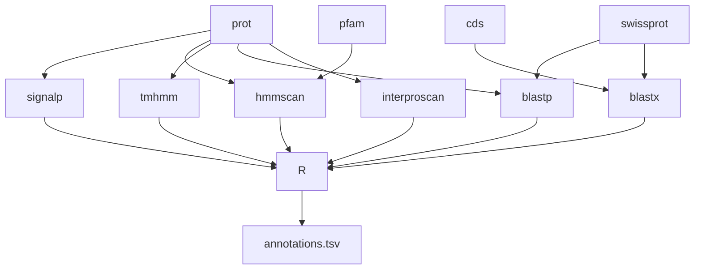

# Marine Omics Annotation Pipeline

Performs functional annotation on mRNA and protein sequences.  This includes predicted transcript (mRNA/CDS) and protein sequences from gene models (eg genome obtained via NCBI or gene models generated in house). It also includes assembled transcripts and corresponding predicted proteins from a denovo transcriptome assembly. 

Note that `moat` primarily performs annotation on proteins.  If provided, nucleotide sequences (transcript sequences) are used only for blastx searches to identify hits that might otherwise be obscured by low quality protein prediction (eg due to a frameshift). No attempt is made to annotate non-coding transcripts. 



## Installation

First install and configure [nextflow](https://www.nextflow.io/). See [here](https://gist.github.com/iracooke/bec2b24a86eb682f7d3055eea15e61aa) for instructions specific to JCU machines (zodiac, genomics1, genomics2)

## Quick Start

Assuming your predicted proteins are in `protein.fasta`, run `moat` as follows on the JCU HPC (`zodiac`).

```bash
nextflow run marine-omics/morp -latest -profile zodiac -r main --prot protein.fasta
```

If desired you may also provide a set of transcripts (nucleotide sequences for your proteins). These should have identical IDs to your proteins. Assuming they are in a file called `transcripts.fasta` you would run `moat` as follows;

```bash
nextflow run marine-omics/morp -latest -profile zodiac -r main --cds transcripts.fasta --prot protein.fasta
```


##  Databases

On JCU systems `moat` should already be configured with access to the databases it needs. These include;

- The Uniprot Swissprot database of annotated proteins (for `blastp` and `blastx` processes)
- The Pfam database of protein domains and families (for `hmmer`)
- A collection of databases required for Interproscan

If these databases are not available on your system you will need to install them as follows;

#### Swissprot

Download and build using commands below.

```bash
wget https://ftp.uniprot.org/pub/databases/uniprot/current_release/knowledgebase/complete/uniprot_sprot.fasta.gz
makeblastdb -in uniprot_sprot.fasta -dbtype 'prot' -parse_seqids -out swissprot
```

This will produce a set of files with names matching `swissprot.*`.  You can tell `moat` to find these files by adding the following setting to your `local.config`

```bash
params.blastdb="<path/to/folder>/swissprot"
```

#### PFam

Download Pfam hmm models

```bash
wget 'https://ftp.ebi.ac.uk/pub/databases/Pfam/current_release/Pfam-A.hmm.gz'
gunzip Pfam-A.hmm.gz 
hmmpress Pfam-A.hmm
```

#### Interproscan

Instructions below assume you are installing Interproscan data in the directory `/scratch/ipr/data`. Adjust according to your preferred installation path.

```bash
IPR=5
IPRSCAN=5.59-91.0

cd /scratch/ipr

wget -O interproscan-data-$IPRSCAN.tar.gz ftp://ftp.ebi.ac.uk/pub/software/unix/iprscan/$IPR/$IPRSCAN/alt/interproscan-data-$IPRSCAN.tar.gz
tar -xvzf interproscan-data-$IPRSCAN.tar.gz
```

Once unpacked this data directory needs to be mounted into the container at a specific path.  We do this by configuring `runOptions` for singularity / docker as follows;

```nextflow
singularity.runOptions = '--bind /scratch/ira/ipr/interproscan/data:/opt/interproscan/data'
```


